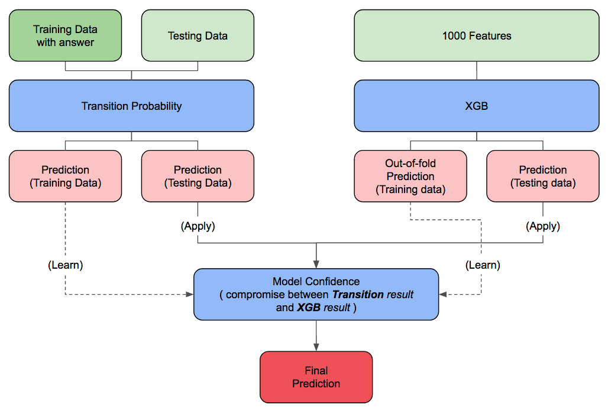

## KKBOX Data Game 17.06

1st solution for [Kaggle KKBOX Data Game 17.06](https://inclass.kaggle.com/c/kkbox-data-game-17-06) Competition.

Note: 

1. This code should be a little bit differ from my submission on Public and Private Leaderboard because of the seed setting.
2. The time of training the classification model may take a long time, because I use the computer with 24 cores. 

### My Approach and Detail
Please see: [Solution link](https://medium.com/@kstseng/kkbox-data-game-17-06-1st-place-solution-2baa14aee5f4)

### How to run program

1. Download and unzip the data, and put it into folder `data`.
2. Execute `run.R`.
